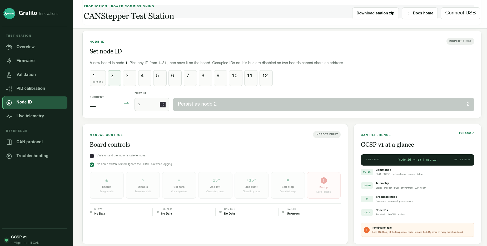

# Quickstart — Grafito CANStepper (GCSP v1)

## 1. Hardware + firmware

Board: **[CANStepper Adapter Board](https://grafito.in/shop/products/canstepper-adapter-board/)** on the Grafito shop.
The current production board is **V2** (JST 2.0 connectors). Earlier **V1**
boards used three different connector types and are harder to cable.

> **Important — encoder magnet:** Mount a **diametrical** magnet on the shaft
> over the MT6701 (≈1–2 mm air gap). Magnet polarity must be **radial**, not
> axial. An axial magnet will not produce a valid encoder angle.

1. Apply main Vin (**5–24 V**, typically **24 V**). **USB does not power the
   ESP32 for programming** — Vin is required to flash; USB-C is data only.
2. Flash `firmware/GrafitoCANStepper_C3` (ESP32-C3, **USB CDC On Boot: Enabled**)
   with Vin connected.
3. Open a serial monitor once: you should see a boot banner like  
   `# GrafitoCANStepper fw 1.2 proto 1` and an MT6701 self-check line with a
   live angle.
4. CAN: termination is **enabled by default** (0 Ω jumper → 120 Ω path). For
   daisy-chain mid-nodes, **remove the 0 Ω resistor**; keep termination on the
   two physical ends (pads can be shorted to restore end termination).
5. With USB and Vin connected, open the
   **[CANStepper Test Station](https://docs.grafito.in/dashboard)** to set the
   node ID, enable the driver, jog, and confirm encoder / TMC / CAN telemetry.

   
6. Install the host library (PyPI: `grafito-canstepper`, import `canstepper`):

```bash
pip install grafito-canstepper

# Development (editable, from this directory):
# pip install -U pip setuptools && pip install -e ".[dev]"
```

## 2. Talk to a node

```python
from canstepper import CANStepperBus

bus = CANStepperBus.serial("/dev/ttyACM0")
print(bus.discover())                        # {1: '1.2'}
node = bus.node(1)
node.enable()
print(node.get_position())                   # encoder degrees
```

## 3. Open-loop spin

```python
node.set_closed_loop(False)
node.set_run_current(40).set_microsteps(16)
node.run(360.0)          # deg/s continuous
# …
node.stop()
```

Open-loop **position** moves use FastAccelStepper’s own trapezoid
(accel → cruise → decel).

## 4. Direction polarity (important for closed loop)

Positive commands must make the encoder angle **increase**. If closed loop
runs away or faults with `NO_PROGRESS`, invert once and persist:

```python
node.set_direction(inverted=True)
node.save_config()
```

## 5. Closed-loop position moves (firmware ≥1.2)

Firmware **1.2+** plans a rest-to-rest **trapezoidal trajectory** for every
`MOVE_ABS` / `MOVE_REL` in closed loop:

```
v_ff(t)  = trapezoid(vmax=cl_max_speed, amax=cl_max_accel)
r(t)     = ∫ v_ff
v_cmd    = v_ff + Kp·(r − encoder) + Ki·∫ − Kd·v_meas
```

Same style of trap generator as [Klipper kinematics](https://www.klipper3d.org/Kinematics.html),
plus encoder tracking so the shaft lands on target. **Not S-curve** (no jerk
limit yet). Full theory, parameter matrix, and production numbers:
**[docs/closed_loop_tuning.md](closed_loop_tuning.md)**.

### Recommended production tune

Characterized on **PR42HS40-1204AF-02** (NEMA 17, 1.8°, 1.2 A, 3.2 mH,
4.2 kg·cm, D-shaft) at **24 V**, firmware **1.2**. Full matrix + **10 min
soak (478/478 settles, 100% success)** in
**[docs/closed_loop_tuning.md](closed_loop_tuning.md)**.

| Setting | Value | Why |
|---------|-------|-----|
| `cl_max_speed` | **4800 deg/s** (800 RPM) | Production cruise; soak-proven |
| Max proven | 6000 deg/s (1000 RPM) | OK at 70% (and short 100% bursts) |
| OL ceiling | ~7200 deg/s (1200 RPM) | Continuous `run()` tracking |
| `run_current` | **70%** | Continuous duty; 100% OK for short bursts only |
| `microsteps` | **8** | Best consistency vs 4 / 16 |
| `stealthchop` | **False** (SpreadCycle) | StealthChop sags at speed |
| Tracking PID | kp=12, ki=0.3, kd=0.10, tol=0.35° | Trim around v_ff only |

```python
node.configure_closed_loop_speed(
    4800.0,                 # cruise deg/s (÷6 = RPM)
    run_current=70,
    microsteps=8,
    stealthchop=False,      # SpreadCycle — required at high speed
    persist=True,
)
node.enable()
node.set_zero()
node.move_to(720.0, blocking=True)
```

### Quick matrix highlights (PR42HS40-1204AF-02, fw 1.2, 8 µstep, SpreadCycle)

| Current | Settles 720…6000? | Notes |
|---------|-------------------|--------|
| 40–85% | Yes | Prefer **70%** continuous |
| 100% (with cool-down) | Yes in dedicated retest | USB drop risk if hammered hard |
| Open-loop `run()` @ 70–100% | Tracks to **~7200** deg/s | Continuous spin, no settle |
| Closed-loop position @ 70% | Cruise **4800–6000** | 10 min soak: **100% success** |

### Why closed-loop can look slower than open-loop `run()`

| Mode | Profile | Settles? |
|------|---------|----------|
| Open-loop `run()` | Constant speed | No |
| Open-loop `move_to` | Trapezoid (FAS) | Step count only |
| CL pre-1.1 | Pure PID chase | Overshoots at high vmax |
| CL 1.1 | Braking-capped PID | No planned cruise |
| **CL ≥1.2** | **Trap + v_ff + PID** | **Planned cruise + stop** |

Open-loop velocity never decelerates to a target. Closed-loop must. On long
moves, 1.2 reaches ~0.8× the continuous open-loop ceiling — expected.

### Measure your motor

```bash
python3 tools/cl_speed_validate.py /dev/ttyACM0 1 70 8
python3 tools/cl_matrix.py /dev/ttyACM0 1 --quick
python3 examples/closed_loop_speed.py /dev/ttyACM0 1 4800
python3 examples/high_speed_test.py /dev/ttyACM0 1 70
```

## 6. Axis units (mm)

```python
from canstepper import Axis

axis = Axis(node, rotation_distance=8.0, name="z")  # 8 mm / rev leadscrew
axis.move_to(50.0, blocking=True)                   # mm
```

## 7. Homing

```python
# Endstop on IO8 (must be HIGH at boot — strapping pin):
node.configure_endstop(enabled=True, active_high=False, action="stop")
axis.home(method="endstop", direction=-1, speed=8.0, backoff=1.0)

# No switch? Sensorless (StallGuard) against a hard stop:
node.set_stall_threshold(60)
axis.home(method="stallguard", direction=-1, speed=5.0, current_percent=25)
```

## 8. Multi-axis time-sync

Host-side `MotionGroup` also uses trapezoid duration math so several axes
finish together (point-to-point, not continuous contouring / look-ahead):

```python
from canstepper import MotionGroup

g = MotionGroup([axis_x, axis_y])
g.move_to({"x": 10.0, "y": 20.0}, blocking=True)
```

## 9. Emergency stop

```python
node.estop()                 # one node (latched; enable() to recover)
bus.group([2, 3]).estop()    # a set of nodes
bus.estop_all()              # every node, single broadcast frame
```

## 10. Whole machines from a config file

See `examples/machine.toml`, then:

```python
from canstepper import Machine

with Machine.from_config("machine.toml") as m:
    m.home("z")
    m.axes["z"].move_to(50.0, blocking=True)
```

## Troubleshooting

| Symptom | Check |
|---|---|
| Flash fails / no CDC | **Vin (5–24 V) applied?** USB does not power ESP32 for programming |
| `discover()` is empty | Vin + USB; port name; USB CDC On Boot; `#` boot lines visible? |
| Motor silent, no hold | `node.enable()`; `run_current`; Vin present (typically 24 V) |
| Stalls / won't settle in closed loop | Raise `cl_max_speed`/`cl_max_accel`; SpreadCycle + higher current; fewer µsteps; `configure_closed_loop_speed()` |
| Closed loop slower than open-loop `run()` | Expected for short moves (accel+decel+settle); on long moves use fw ≥1.2 and raise cruise to the OL ceiling |
| Angle noisy / jumps while stationary | MT6701 SSI `SPI_MODE3`; magnet centering/gap; CLK/DO/CS wiring |
| Closed loop runs away / `NO_PROGRESS` | Toggle `node.set_direction(True)` so +command increases encoder |
| Encoder fault code 1 | Sustained SSI loss; reflash latest firmware (rides through isolated CRC errors) |
| Two-node bus dead | Default term ON — ends keep 0 Ω / pads shorted; mid-chain **remove 0 Ω**; `get_can_health()` |
| Board won't boot with endstop wired | IO8 HIGH at reset (strapping pin) |
